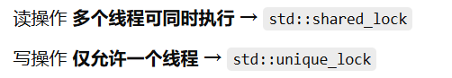

# KV存储引擎
非关系型数据库的核心数据结构是跳表。

本项目是基于跳表实现的轻量级键值型存储引擎。

核心技术点:
+ 模板元编程 ✅
+ 读写锁（shared_lock）对查找和修改进行优化 ✅
+ 支持并发读取和修改 ✅

# 🚀实现的功能
+ insertElement（插入数据） 
+ deleteElement（删除数据） 
+ searchElement（查询数据） 
+ displayList（展示已存数据）
+ expired_cleanup（后台清理线程，可能存在并发问题）
+ range_query(范围查询) 返回指定区间内所有未过期的键值对
+ size（返回数据规模）
+ TTL（生命周期管理：TTL过期、自动清理、更新TTL、查询TTL、持久化Key）
+ 内存释放（刚开始使用递归释放，但是如果层数深会爆栈，所以采用迭代法）

# 💡待实现的功能
+ 手动更新TTL
+ 能否缝合一个日志系统进来（好像在B站）
+ dumpFile（数据落盘） 【还不完善】
+ loadFile（加载数据） 【还不完善】

# 🍓学习知识
读写锁在C++11中为shared_lock,写锁和读锁锁定方式不一样，
要注意的是在进行写之前要先释放读锁。

